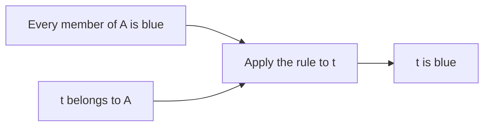

# Original example: checking an argument

English · [简体中文](README.zh-CN.md)

This small example was authored for this template, not extracted from a course. It illustrates lesson organization; it is not a complete course or an executable pipeline.

To practise with a public-domain PDF, follow [the short practice tutorial](../guides/first-session.md). Source details and the 12-page learning scope are in [Central tendency](central-tendency/README.md).

## Goal and input

Determine whether a conclusion follows from premises. Our premises are: “Every object in collection A is blue” and “Object t belongs to collection A.” The proposed conclusion is “Object t is blue.”

## From premises to conclusion

A premise is a statement accepted for this argument. A conclusion follows when the premises cannot all be true while the conclusion is false.

The first premise applies to every member of A. The second places t in A, so the first applies to t.

The two premises are inputs; applying the general rule to the specified member produces the conclusion. The argument establishes a consequence of the premises, not whether those premises describe reality.

## Boundary and check

Remove “t belongs to A.” Then t may be outside A and red while every member of A is blue. The remaining premise is true but the proposed conclusion is false: the removed premise was necessary for this argument.

## Retrieval question

If an object is blue, must it belong to A? Try answering before opening the explanation.

Answer

No. The premise restricts the color of members of A, not membership of every blue object. A blue object outside A is a counterexample.

No learner performance is recorded by this example. A tutor records mastery only after observing an independent response.
