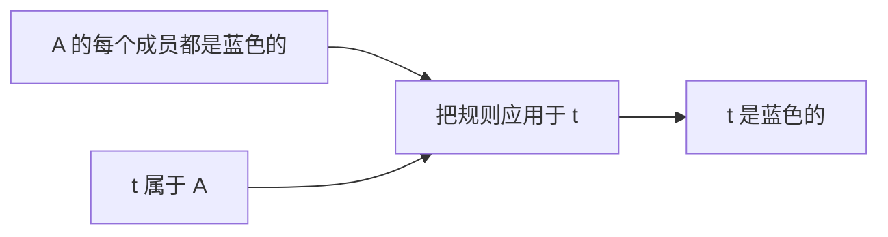

# 原创样例：检查一个论证

简体中文 · [English](README.md)

本例为模板原创，不摘自课程。它展示笔记组织方式，不是完整课程或可执行管线。

## 目标与输入

判断结论能否从前提推出。前提是：“集合 A 的所有对象都是蓝色的”和“对象 t 属于集合 A”。待判断的结论是“对象 t 是蓝色的”。

## 从前提到结论

前提是本次论证接受的陈述。如果不可能出现“前提全部为真而结论为假”，结论就能从这些前提推出。

第一个前提适用于 A 的每个成员。第二个前提确定 t 在 A 中，因此第一个前提适用于 t。

两个前提是输入；把一般规则应用于指定成员，得到结论。论证确定的是前提的推论，不证明前提本身符合现实。

## 边界与核验

去掉“t 属于 A”。此时 t 可以在 A 外且为红色，同时 A 的每个成员仍是蓝色。剩余前提为真，待判断的结论却为假：被删去的前提对这个论证有必要。

## 回忆问题

如果一个对象是蓝色的，它一定属于 A 吗？先尝试回答，再展开解释。

答案

不一定。前提约束的是 A 中成员的颜色，而非所有蓝色对象的归属。A 外的蓝色对象就是反例。

本例不记录学习者表现。只有观察到独立作答后，导师才能记录相应掌握证据。
